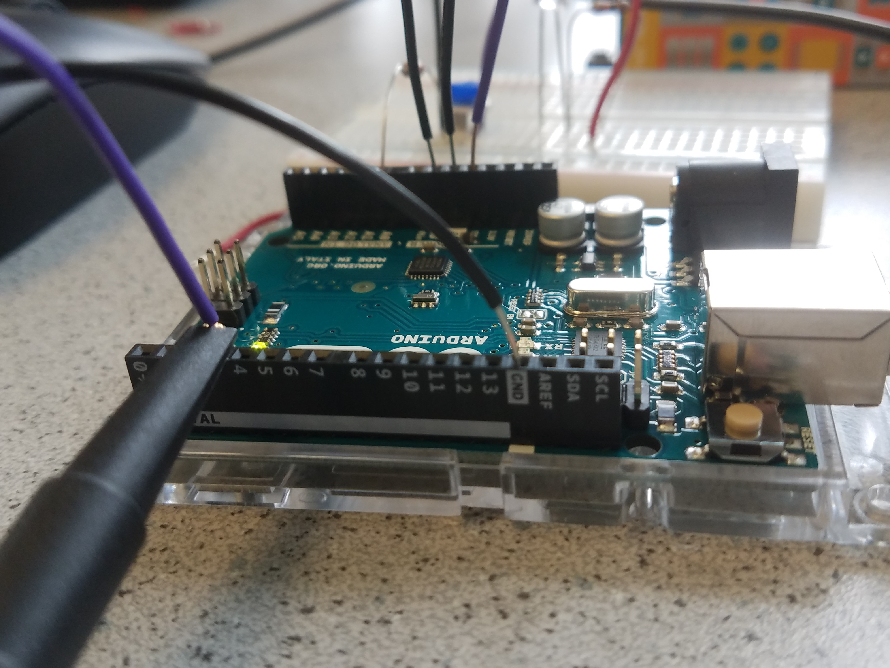

# ECE 3400 Team 2: Overbuilt & Underpaid
* ## [Home](./index.md)
* ## [Team Info](./info.md)
* ## [Labs](./labs.md)
* ## [Meeting Minutes](./minutes.md)

This website is designed to illustrate the steps our team took in
creating our line-following robot via an Arduino Uno. Click the [Labs](./labs.md)
tab to follow our procedure.

