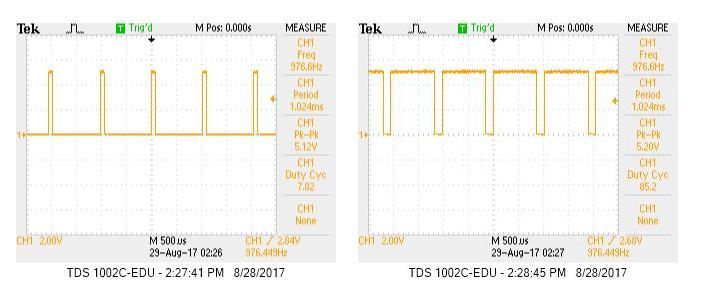

# ECE 3400: Labs
* ## [Home](./index.md)
* ## [Team Info](./info.md)
* ## [Labs](./labs.md)
* ## [Meeting Minutes](./minutes.md)

## LAB 1: Microcontroller

### Purpose

The main purpose of this lab was to become familiar with the arduino architecture, and
learn basic functionality. In particular, we spent a lot of time working with various I/O ports since
these are the main way we will send and receive signals to sensors/motors/etc...
In this lab, we learned basic functionality of arduino by writing small programs to control LEDs and servos. 
At the end of this lab we were able to put together the beginnings of our robot which was able to autonomously move in a given direction. 

### Procedure

We first split up into two groups of 3 people each. We ensured that each group contained someone knowledgeable
of arduino so if the group hit any road blocks, they would be able to assist. Each group progressed through the
lab individually as described below

#### Materials Used:
* 1 Arduino Uno
* 1 USB A/B cable
* 1 Continuous rotation servo
* 1 LED 
* 1 Potentiometer
* Several Resistors
* 1 breadboard

### Arduino Code (IDE)

We began by installing the arduino IDE to be able to program the board. Once the IDE was installed,
we opened a new sketch. Within a new sketch, there are two default functions as described below:

#### _**void setup() {}**_
Called at the start of the entire program. Used to initialize any necessary structures
and set up the arduino for the rest of your program. Generally used to setup I/O pins and prepare
for execution

#### _**void loop() {}**_
Function which contains the main execution of your code. This function should not return, and should
loop forever. This is where the interesting parts of the code happen.

In addition to these two functions, you can declare any extra helper functions you want. These can then be
called from either ```void setup()``` or ```void loop()```.

### Blink

To start programming, we opened one of the default examples included with the arduino IDE. Selecting the
Blink sketch from _File > Examples > 1.Basics > Blink_. Within the IDE, you can compile your code by clicking the
checkmark in the top left corner. This converts the sketch into C code, which is then compiled to assembly code to be run
on the arduino uno. At this point, any code which contains errors will fail to compile. Once you are ready to run the program
on the board, you can select the upload button (arrow next to compile button). This will compile the code and put the program
on the uno.

The code will automatically begin running if the board is powered on. If the board loses power, the program will remain in
memory, and will run again when the board is turned on. The board can either receive power from a DC power supply (9V battery) or
from the programing cable connected to the computer. Once the Blink sketch was downloaded onto the board, the onboard LED would
blink every second. Looking at the code for the Blink program, we can see how it operates on the arduino uno.

#### Base Code

```c
void setup() {
    // initialize digital pin LED_BUILTIN as an output.
    pinMode(LED_BUILTIN, OUTPUT);
}
```
This code tells the arduino that the built in LED should act as an output. This allows you to write voltage values to the LED,
and turn it off/on.
```c
void loop() {
    digitalWrite(LED_BUILTIN, HIGH);   // turn the LED on (HIGH is the voltage level)
    delay(1000);                       // wait for a second
    digitalWrite(LED_BUILTIN, LOW);    // turn the LED off by making the voltage LOW
    delay(1000);                       // wait for a second
}
```
This is the main function which blinks the LED. Because the LED was set as an output pin in the setup function, we are able to write
a ```HIGH``` or ```LOW``` value to it. These variables are global variable defined for the arduino. They correspond to logical high and
low values. In between turning the LED on/off the program waits for 1 second so you can actually see the LED change.

The exact specification for these functions can be found in the [Arduino Reference](https://www.arduino.cc/en/Reference/HomePage).

#### External LED

In order to modify the code to blink an external LED, we simply have to modify the I/O pin which we write to. Rather than using
the global variable ```LED_BUILTIN```, we passed the pin number we wanted to use to the necessary functions. Now, setup and loop
functions looked as below:

```c
void setup() {
    // initialize digital pin 11 as an output.
    pinMode(11, OUTPUT);
}

void loop() {
    digitalWrite(11, HIGH);   // turn the LED on (HIGH is the voltage level)
    delay(1000);                       // wait for a second
    digitalWrite(11, LOW);    // turn the LED off by making the voltage LOW
    delay(1000);                       // wait for a second
}
```

This completed the software necessary to make the system work, but we still had to wire the external LED to the digital pin. In order to prevent the pin
from sourcing too much current and possibly ruining the pin, we connected the LED in series with a 300 ohm resistor. The ground connection is then
taken from the arduino's ground. This is simply another pin on the board, and is necessary for the voltage on the digital output pin to have any meaning as
voltages are always from one location to another. Once we hooked up the entire circuit and downloaded the program to the uno, the external LED blinked every
second just like the onboard LED in the prior section.

Once we confirmed this worked, we adjusted the code and external circuit to test all of the digital pins on the board. In the code, we had to change
the pin number that we set as a digital output and wrote to. In the circuit, we had to change the pin that the LED was connected to to match the one set
in code.

### Analog Pins and Serial Monitor

#### Analog Input

While digital I/O is nice, often times analog inputs are necessary as signals in the real world are analog. The arduino has six analog input
pins (A0 -> A5). Since these pins only serve as inputs, they do not need to be configured as an input/output pin like the digital pins in the previous section.
In order to provide an analog signal to the arduino uno, we used a potentiometer to produce a varying voltage value.
We supplied the potentiometer using Vdd and Ground from the arduino. The third pin of the potentiometer represented the output voltage
of a voltage divider. Again, we ran this voltage through a 300 ohm resistor prior to passing it into the analog input pin. This is
simply a saftey precaution to ensure the pin does not source too much current.

In order to output the analog value to the serial monitor, we had to modify our code slightly as below.

```c
void setup() {
    Serial.begin(9600);
}

void loop() {
    val = analogRead(A0);
    Serial.println(val);
}
```

In the ```setup()``` function, we have to initialize the serial monitor by calling ```Serial.begin(i)```. The value passed to this function is the baudrate
to use for the serial monitor. In the loop, we continually read the analog value from pin A0 and print it out to the monitor
using ```Serial.println()```. As we adjusted the potentiometer with a screwdriver, we could see the values being ouputed to the serial monitor
change.

The ```analogRead()``` function converts a voltage between 0 and 5 volts to an integer number between 0 and 1023.
We then repeated this for all of the analog pins to ensure they worked properly.

#### Analog Output

Analog output can be simulated using a pulse-width modulation. This is only possible on certain pins on the arduino uno. In particular, pins 3, 5, 6, 9, 10,
and 11 can be used. This allows us to simulate an analog output. To demonstrate this, we used this feature to vary the brightness of
an LED. In order to do this, we utilized aspects from the previous lab exercises.

First, we used the potentiometer to provide an anolog input to the arduino, and wired an LED to one of the digital output pins which support
PWM. Again, we had to slightly modify our code as below.

```c
void setup() {
    Serial.begin(9600);
    pinMode(3, OUTPUT);
}

void loop() {
    val = analogRead(A0);
    Serial.println(val);
    analogWrite(3, val / 4);
}
```

While it is not necessary to use the serial monitor, we left the code in to aid for debugging purposes.

One thing to note is the value we read in from the analog pin must be divided by 4 prior to being passed to the output pin. This is becuase the
output only takes values between 0 and 255, while the analog input can have a value up to 1023. The way the PWM works is by creating a square wave with
varying duty cycle. If the output is 0, then the signal will be always off. If the output is 255, then the signal will be always on. To further understand the changes in the duty cycle, we used an oscilloscope to measure the voltage output.



*When the LED is at it's lowest brightness, the signal is almost always at 0V. When the LED is at it's highest brightness, the signal is almost always at maximum voltage.*


#### Servos 

We hooked up the servo to a digital pin that allows PWM. To use the standard servo functions, we included the Servo.h library and utilized myservo.write() to set different speeds varying between a range of 0-180: 0 indicated full speed in reverse, 90 is no speed, and 180 is full speed forward. We then used a screwdriver to manually alter the potentiometer values in order to control the speed and direction of the servo. 

#### Robot!

Using our new knowledge of programming servos, we attached two servos to wheels, added a chassis and placed the arduino on top as well as the breadboard containing our wiring. We hooked up a 5V battery back to the arduino and programmed our robot to move forwards, backwards or in a circle. 

<iframe width="560" height="315"
src="https://www.youtube.com/embed/onVxR9bHQKk?rel=0"
frameborder="0" allowfullscreen>
</iframe>
