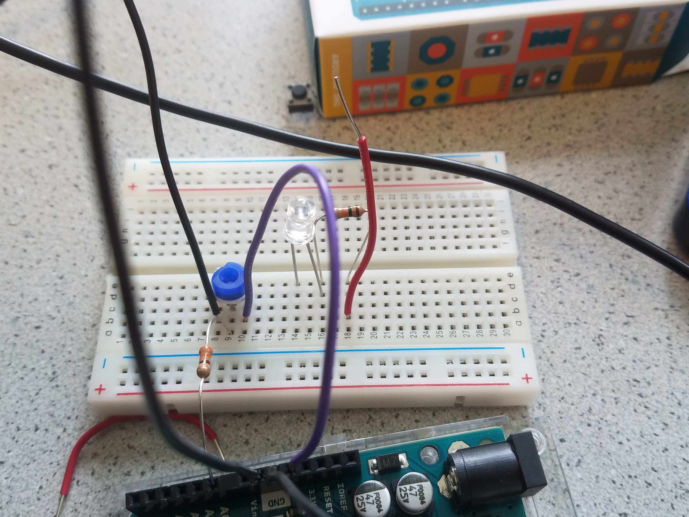

# ECE 3400: Labs
* ## [Home](./index.md)
* ## [Team Info](./info.md)
* ## [Labs](./labs.md)
* ## [Meeting Minutes](./minutes.md)

## LAB 1: Microcontroller

### Purpose

In this lab, we learned basic functionality of arduino by writing small programs to control LEDs and servos. 
At the end of this lab we were able to put together the beginnings of our robot which was able to autonomously move in a given direction. 

### Procedure

We first split up into two groups of 3 people each. We ensured that each group contained someone knowledgeable of arduino so if the group hit any road blocks, they would be able to assist.

#### Materials Used:
* 1 Arduino Uno
* 1 USB A/B cable
* 1 Continuous rotation servo
* 1 LED 
* 1 Potentiometer
* Several Resistors
* 1 breadboard

#### Blink

We pulled up the arduino sample code blink. We wired blue LED in series with a 1KOhm resistor to digital pin 13 and adjusted the code to blink the digital 13 pin instead of the on board LED. We repeated this for all digital pins to test that they functioned properly. 

#### Analog Pins

We wired a pontentiometer in series with a 300Ohm resistor to test the analog pins. We used a serial print function to display the value of the pin in mV to the serial monitor, which can be accessed under the tools bar in Arduino IDE. The max voltage we read was 1.024 V.

#### Analog Output

We used the value of the potentiometer to vary the brightness of the LED. The LED must be hooked up to one of the 4 pins that allow PWM. The analogwrite function allowed us to write the value of the pontentiometer to the digital pin with the LED so that the brightness changed when the potentiometer value changed.

#### Servos 

We hooked up the servo to a digital pin that allows PWM. To use the standard servo functions, we included the Servo.h library then wrote different speeds (0-180) to the servo. We then used the potentiometer values to control the speed and direction of the servo. 

#### Robot!

Using our new knowledge of programming servos, we attached two servos to wheels, added a chassis and placed the arduino on top as well as the breadboard containing our wiring. We hooked up a 5V battery back to the arduino and programmed our robot to move forwards, backwards or in a circle. 

<iframe width="420" height="315"

src="https://www.flickr.com/photos/154473257@N08/36820641636/in/datetaken/">

</iframe>
